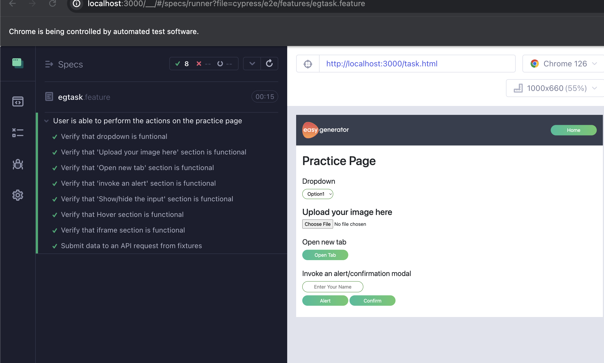

# Egtask Automation

This project uses [Cypress](https://www.cypress.io/) and [Cucumber](https://cucumber.io/) to automate the features

### Prerequisites

1. [node](https://nodejs.org/en/)
2. npm

### Dependencies

The project has the following dependencies:

1. cypress: JavaScript end-to-end testing framework built on top of Node.js.
2. @badeball/cypress-cucumber-preprocessor: Cypress preprocessor that allows us to use Gherkin syntax to write tests.
3. @bahmutov/cypress-esbuild-preprocessor: Cypress preprocessor that uses esbuild to bundle and transpile test files.
4. esbuild: JavaScript bundler and transpiler that compiles modern JavaScript code for older browsers.
5. http-server: Simple command-line HTTP server to serve static files.
6. prettier: Opinionated code formatter to ensure consistent code style.
7. typescript: Strongly typed programming language that builds on JavaScript.

### Getting started

To get started, clone this repository and install the dependencies:

git clone https://github.com/prgupta1995/assignment-test-suite.git
cd assignment-test-suite

```
npm install
```

To run the testcases, fisrtly we should run the below command to start the http-server:

```
npm run httpserver
```

We can then run the tests using Cypress:

```
npm run cypress:open
```

This will open the Cypress Test Runner, where we can select the `egtask.feature` file and run the tests.

We can run the tests in headless mode:
npm run cypress:run:headless

### Project structure

The project has the following file structure:

```
├── assets
│   ├── img
│   │   └── testImage.png
│   └── alert-text.txt
├── cypress
│   ├── e2e
│   │   ├── features
|   |   |   └── egtask.feature
|   |   └── step_definitions
|   |       └── egtask.ts
│   ├── fixtures
|   |   └── form.json
│   └── page_objects
|       └── egtask.ts
├── public
|   └──task.html
├── .gitignore
├── .prettierrc
├── cypress.config.ts
├── package-lock.json
├── package.json
├── README.md
└── tsconfig.json
```

The `e2e` folder contains the feature file and the step definitions that implement the test.
The `page_objects` folder contains the page objects that implement the test.
The `fixtures` folder contains the json data for api request.
The `package.json` file lists the project metadata and dependencies.

### Test Results


